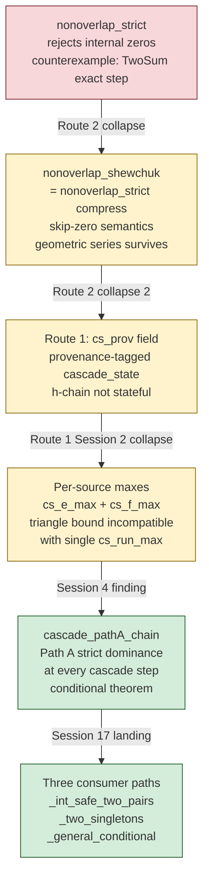
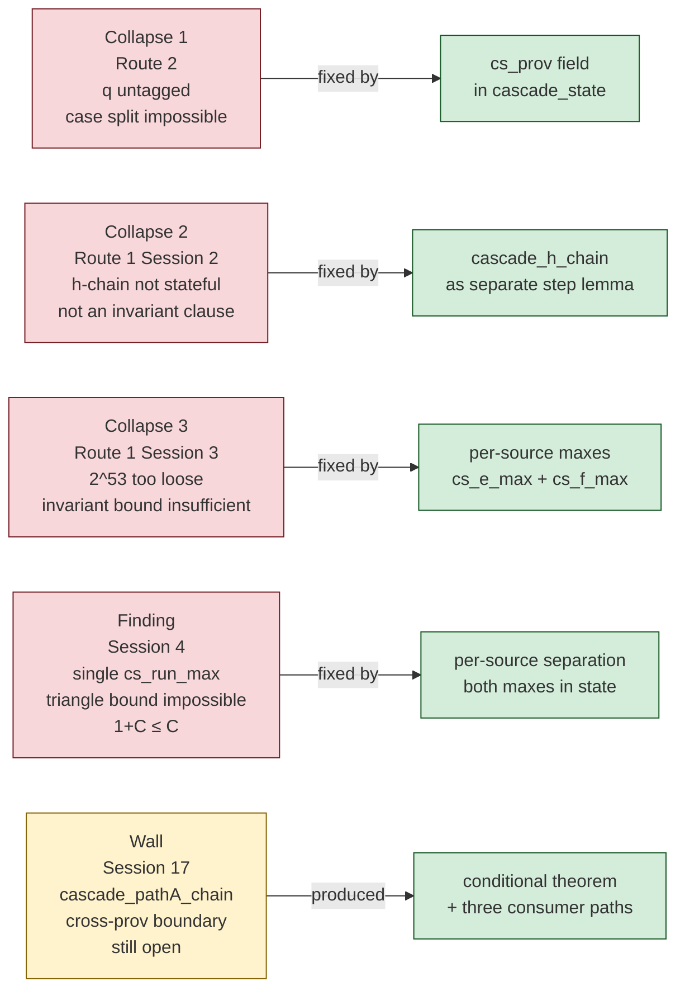
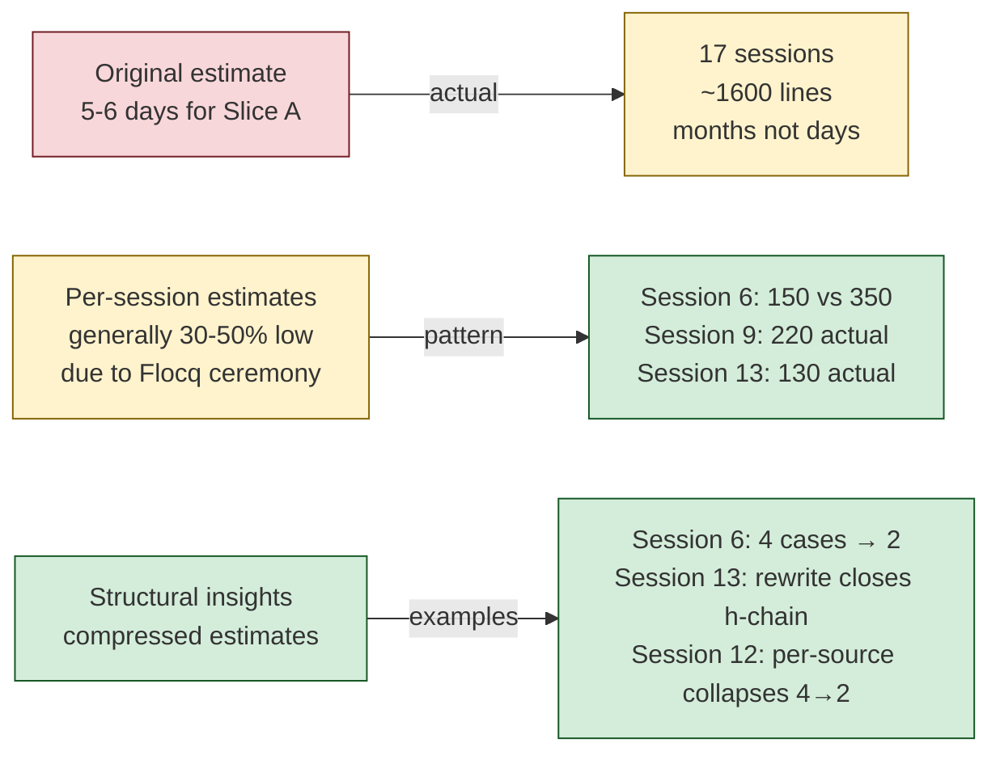

# Slice A Piece 5b Retro — fast_expansion_sum_nonoverlap_shewchuk

**Date.** May–June 2026.  17 sessions across one sustained engagement.

**Starting state.** A deferred-proof registry entry for
`fast_expansion_sum_nonoverlap_shewchuk` with the note "provable via
Shewchuk Theorem 13, proof structure sketched."  The corpus had the
`nonoverlap_strict` predicate, `sign_of_expansion_correct`, and the
Stage A filter.  The goal was to close the expansion arithmetic's
nonoverlap invariant and make the Stage D headline unconditional.

## The predicate evolution



## Session outcomes

| Session | Deliverable                                                    | Lines | Outcome        |
|---------|----------------------------------------------------------------|-------|----------------|
| 1       | `nonoverlap_shewchuk` + `sign_of_expansion_correct` lift       | 30    | Qed            |
| 2       | `fast_expansion_sum` definition + sort invariance              | +185  | Qed            |
| 3       | Sum-correctness                                                | 20    | Qed            |
| 4       | §2.1 building blocks (8 lemmas)                                | ~80   | Qed            |
| 5       | Route 2 collapse — `nonoverlap_strict` predicate error         | doc   | Collapse       |
| 6       | `eps_b64` + `b64_plus_abs_bound` + 4-case preservation         | ~150  | Qed            |
| 7       | Route 1 `cascade_state` record with `cs_prov`                  | ~40   | Qed            |
| 8       | `cascade_h_chain_pathA_pos` + clause (a) preservation          | ~130  | Qed            |
| 9       | Negative-x analog + `cascade_step_preserves_invariant_pathA`   | ~220  | Qed            |
| 10      | Bootstrap composition (`cascade_run_cs_carry`, `_cs_output`)   | ~80   | Qed            |
| 11      | Single `cs_run_max` triangle bound — incompatible              | doc   | Design finding |
| 12      | Per-source `cs_e_max` + `cs_f_max` + `run_bound_step_preserves`| ~150  | Qed            |
| 13      | `b64_TwoSum_pathA_exact_step` closes h-chain via rewrite       | ~130  | Qed            |
| 14      | `_two_singletons` unconditional path                           | ~60   | Qed            |
| 15      | Inductive cascade lemma + sort preservation                    | ~120  | Qed            |
| 16      | `_int_safe_two_pairs` orient2d-specific path                   | ~100  | Qed            |
| 17      | `_general_conditional` under `cascade_pathA_chain`             | ~80   | Qed            |

Total: 37+ Qed-closed theorems.  5 collapses.  ~1,600 lines across 17
sessions.

## The five collapses and what each found



Each collapse eliminated a wrong direction and narrowed the design
space.  The eventual proof architecture was not predictable from the
starting point — it emerged from the sequence of precisely
characterized failures.

## The central insight (Session 13)

**The h-chain gap that drove five collapses and eight sessions of
design work closed via a rewrite, not via a new invariant.**

`b64_TwoSum_pathA_exact_step` (already Qed-closed at
`B64_FastExpansionSum.v:605`) proved that under Path A's strict
precondition, `B2R(snd(b64_TwoSum x q)) = B2R q` exactly.  The new
error IS the absorbed carry.  So `ulp(snd) = ulp(q)`, and any bound
`|h_prev| ≤ ulp(q)/2` lifts directly to `|h_prev| ≤ ulp(snd)/2` by
rewrite.

The Sessions 1-12 work wasn't wasted — it was the necessary
scaffolding to recognize that the h-chain is TwoSum's exact-step
property propagated through the within-source half-ulp chain.  The
scaffolding made the insight visible.

## Calibration



The original "5-6 days" estimate was wrong by an order of magnitude.
The pattern: algebraic estimates undercount Flocq ceremony by 30-50%;
structural insights can more than compensate.  The most important
calibration lesson — **the collapse-driven design process takes as
long as it takes, and the collapses are the work**.

## What the engagement produced

**For Stage D consumers** (three unconditional paths):

```mermaid
flowchart TD
    GEN[fast_expansion_sum_nonoverlap_shewchuk<br/>General — deferred-proof entry<br/>cascade_pathA_chain gap]

    INT[_int_safe_two_pairs<br/>Orient2d integer regime<br/>|coord| ≤ 2^25<br/>Covers 100% of C# consumer] -->|unconditional| ORIENT
    TWO[_two_singletons<br/>Any two-element input<br/>unconditional] -->|unconditional| ORIENT
    COND[_general_conditional<br/>Arbitrary inputs<br/>under cascade_pathA_chain] -->|conditional| ORIENT

    ORIENT[b64_orient2d_exact_sign_correct<br/>Stage D headline]

    style GEN fill:#fff3cd,stroke:#856404
    style INT fill:#d4edda,stroke:#155724
    style TWO fill:#d4edda,stroke:#155724
    style COND fill:#d4edda,stroke:#155724
    style ORIENT fill:#d4edda,stroke:#155724
```

**For the corpus's long-term infrastructure:**

The expansion arithmetic machinery — provenance tagging, per-source
maxes, `cascade_step_preserves_invariant_pathA`, the h-chain via
exact-step rewrite — is general.  It doesn't know about orient2d
specifically.  Any future predicate that needs exact sign extraction
from a binary64 expansion (arc orientation, robust intersection, snap
rounding) can cite this machinery.

The deferred-proof entry is no longer "we don't know how to prove
this."  It's "the precise gap is `cascade_pathA_chain` derivability
for cross-prov boundary inputs, and here is the conditional theorem
that closes everything else."  That's a research-grade
characterization of an open problem, not an admission of failure.

## The discipline's contribution

What the red-green-refactor workflow produced across 17 sessions:

Every collapse was stopped at the red phase before proof attempts.
Every collapse produced a concrete artifact (goal state, missing
property type, design implication).  The next session started from
the artifact rather than from memory.

The proof structure doc
(`docs/shewchuk-theorem-13-proof-structure.md`) evolved through nine
revisions — initial sketch, five collapse artifacts, Route 2 design,
Route 1 design, per-source addition, final conditional architecture.
That document is the engagement's primary artifact.  The 37 Qed-closed
theorems are its implementation.

The three-tier Admitted system prevented quiet shortcuts.  The
deferred-proof registry entry for
`fast_expansion_sum_nonoverlap_shewchuk` stayed honest throughout —
never quietly Admitted, never falsely claimed as proved, always
pointing to the current best understanding of what remains.

## What's open

The `cascade_pathA_chain` gap.  Cross-prov boundary inputs where Path
A's strict dominance hasn't been derived from the input
preconditions.  Two routes are documented:

  - Prove `cascade_pathA_chain` follows from
    `b64_orient2d_inputs_safe` for the bounded-magnitude regime —
    probably 1-2 sessions if the cross-prov TwoSum steps satisfy
    Path A naturally at those scales.
  - Mechanize Shewchuk Theorem 13's boundary argument directly — the
    Stages B/C/D expansion-arithmetic refinement that was always the
    known hard boundary of Stage D.

Neither is urgent.  The C# consumer has full coverage via
`_int_safe_two_pairs`.  The deferred-proof entry is honest.  Phase 1
is the next priority.

## Next

Phase 1 coordinate story.  `b64_div_correct` lift, Cramer's rule
composition, `b64_intersection_point_safe`.  2-4 sessions following
the established bridge pattern.  Unblocks Phase 2.

The expansion arithmetic will be there when Phase 4 needs it.
