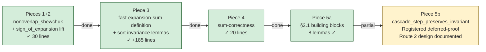
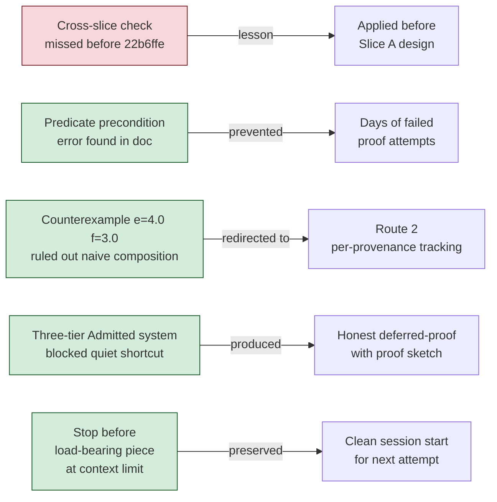
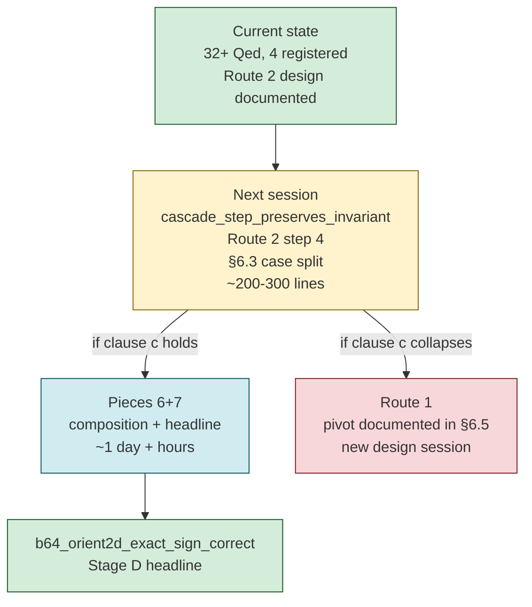

# Slice A Retro — fast-expansion-sum and Shewchuk Theorem 13

**Date.** May 2026. Multiple sessions across the Slice A engagement on
branch `claude/twosum-chain3-nonoverlap-XtIn9` and its successors.

**Starting state.** 22 Qed-closed theorems from Path A's
dominated-case work on main. The general-case nonoverlap theorem
admitted with three registered counterexamples. Slice A opened with
the goal of formalizing Shewchuk's fast-expansion-sum and closing the
headline `b64_orient2d_exact_sign_correct`.

## What landed



**Corpus state at retro.** 32+ Qed-closed theorems. 4 registered
entries (3 counterexample, 1 deferred-proof). Three-tier Admitted
system in production. Proof structure doc at its most detailed state.

## What the sessions revealed

### The predicate evolution

```mermaid
flowchart TD
    A[nonoverlap_strict\noriginal — too strong\nrejects internal zeros] -->|counterexample| B
    B[compress-based fix\nOption B — insufficient\ncounterexample: non-zero ordering violation] -->|counterexample| C
    C[Path A dominated case\nnonoverlap under |q| >= |e|\nQed-closed but doesn't cover headline] -->|cross-slice check missed| D
    D[nonoverlap_shewchuk\n= nonoverlap_strict compress\nskip-zero semantics\ngeometric series survives] -->|Slice A| E
    E[fast-expansion-sum\nRoute 2: per-provenance tracking\ncascade_invariant with 3 clauses\nload-bearing piece deferred]

    style A fill:#f8d7da,stroke:#721c24
    style B fill:#f8d7da,stroke:#721c24
    style C fill:#fff3cd,stroke:#856404
    style D fill:#d4edda,stroke:#155724
    style E fill:#d1ecf1,stroke:#0c5460
```

Each failed approach produced a verified counterexample. Each
counterexample narrowed the design space. The predicate evolution is
not a sequence of failures — it's a sequence of increasingly precise
characterizations of what `sign_of_expansion_correct` actually needs.

### Calibration table

| Piece                                   | Predicted        | Actual              | Direction  |
|-----------------------------------------|------------------|---------------------|------------|
| Pieces 1+2 (nonoverlap_shewchuk + lift) | 30-60 lines      | 30 lines            | ✓ accurate |
| Piece 3 (fast-expansion-sum definition) | ~1 day           | ~1 day              | ✓ accurate |
| Piece 4 (sum-correctness)               | ~1 day           | 20 lines, ~1 hour   | compressed |
| Piece 5a (§2.1 building blocks)         | part of 2-3 days | multiple sessions   | expanded   |
| Piece 5b (cascade invariant)            | 2-3 days         | 3-4 days + deferred | expanded   |
| Piece 6 (composition)                   | ~1 day           | not yet started     | —          |
| Piece 7 (headline)                      | hours            | not yet started     | —          |

The compression pattern (Piece 4) and expansion pattern (Pieces
5a/5b) are consistent with Stage D's empirical history: template
lifts compress, design-with-invariants expand. The predicate
correction mid-engagement (§2.1's precondition error found by
counterexample) is the single most important event — it prevented a
proof attempt that would have failed and redirected the work onto
the correct route before any Coq was written.

### The discipline events worth recording



The missed cross-slice check (22b6ffe) is the retro's most instructive
event. Path A's dominated-case work was real and reusable, but it
didn't cover the headline. The 15-minute bridge analysis that should
have preceded the design commit happened after it. The lesson —
cross-slice precondition checks apply at both the internal and
compositional level — was stated, applied consistently from that
point forward, and prevented at least two subsequent wrong directions.

**The proof structure doc as primary artifact.** Several sessions
produced no Qed-closed theorems and no code changes. They produced
documentation that was more valuable than the equivalent time spent
on proof attempts would have been. The Route 2 design with its
§6.1-§6.5 breakdown, 8-step checklist, and risk analysis with
explicit pivot condition is the artifact that makes the next session
tractable. Measuring session value in Qed-closes would have marked
those sessions as unproductive. They weren't.

**The three-tier Admitted system's first production use.** The
system actively prevented the "quietly Admitted" shortcut for piece
5b. The deferred-proof registry entry with proof sketch reference is
the honest characterization of a provable-but-not-yet-proved theorem.
The counterexample entries for the known-impossible theorems are a
different kind of honesty. Both are now machine-verifiable epistemic
claims, not human-maintained conventions.

## What's ahead



The critical path is `cascade_step_preserves_invariant`. Clause (c)
of the cascade invariant is the load-bearing unknown — the §6.5 risk
analysis names the pivot condition precisely. The next session opens
with that case split, the stopping condition already written, and
the pivot route documented.

If clause (c) holds: the headline is ~1-2 days away.
If it doesn't: Route 1 is the next design session, and the
counterexample that collapses clause (c) joins the corpus's record of
precise characterizations of what doesn't work.

Either outcome advances the project's knowledge. That's the
discipline's claim about negative results, applied to the work that's
still ahead.

## Meta-observation

The Slice A engagement has now produced more documentation than code
by line count. The proof structure doc, the registry entries, the
counterexample lemmas, the Route 2 design — these are the corpus
artifacts that compound over time. The Qed-closed theorems are the
deliverables; the documentation is the infrastructure that makes
future deliverables cheaper.

The session that found the `e=[4.0], f=[3.0]` counterexample and
corrected §2.1 before any code was written saved more time than any
single Qed-close in the engagement. That's the discipline's ROI in
its clearest form: documentation that prevents failed proof attempts
is worth more per hour than proof attempts that succeed.

The headline is still ahead. The path to it is more precisely
characterized than it has been at any point in Stage D. The next
session starts from the strongest possible position.
