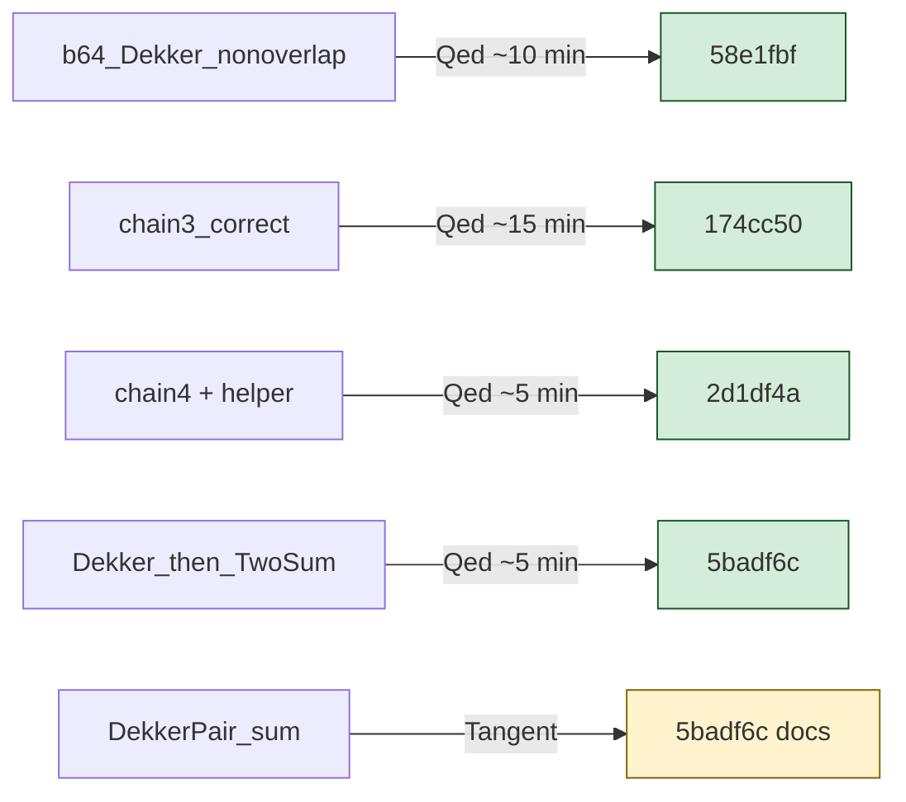
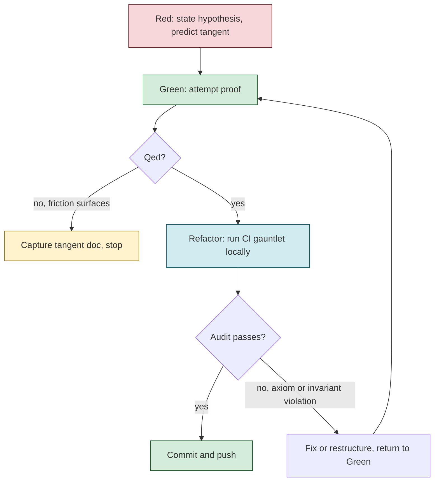
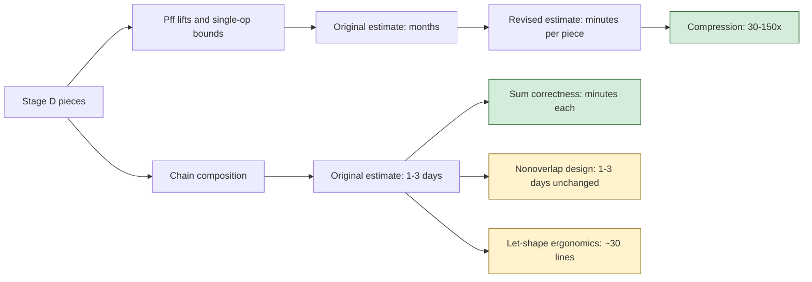
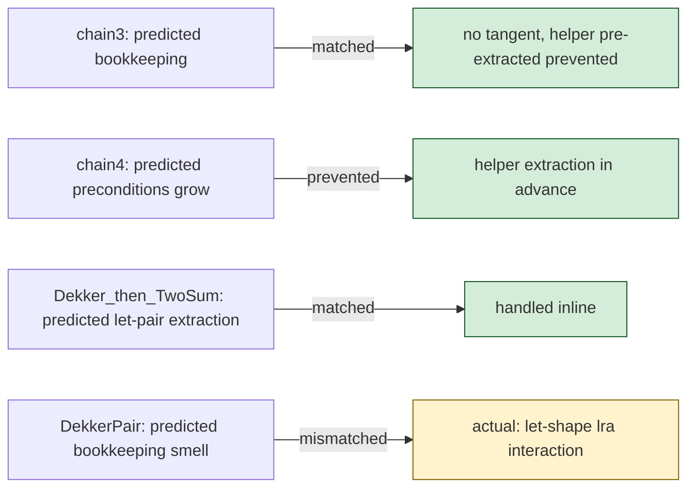
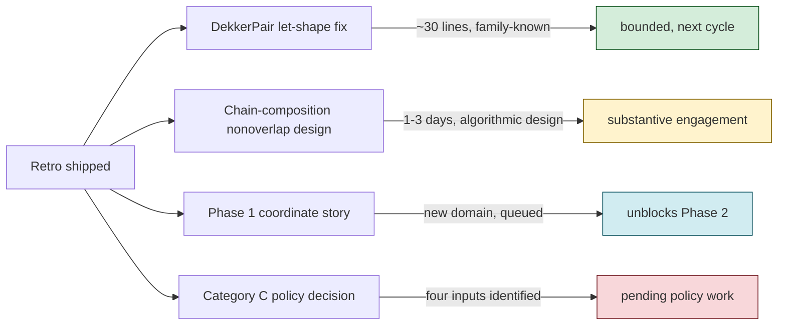

# Stage D Push Retro

**Date.** May 2026. Five red-workflow cycles across one focused session.

**Context.** Continuation of Stage D after the policy framework and CI ratchet landed earlier in the day. The session was the first sustained test of the red-green-refactor discipline operating with the rigorous CI gauntlet as the refactor phase. Goal: ship what Qeds cleanly, document tangents at the first sign of friction, accumulate empirical data on cycle time and prediction accuracy.

## Cycle outcomes

| Slice | Hypothesis | Outcome | Time |
|-------|-----------|---------|------|
| `b64_Dekker_nonoverlap` | error ≤ half-ulp via Dekker_correct + error_le_half_ulp_round | Qed first attempt | ~10 min |
| `b64_TwoSum_chain3_correct` | 2× TwoSum_correct + lra | Qed first attempt | ~15 min |
| `b64_TwoSum_chain4_correct` + helper | chain_n pattern scales mechanically | Qed first attempt | ~5 min |
| `b64_Dekker_then_TwoSum_correct` | Dekker_correct + TwoSum_correct + lra | Qed first attempt | ~5 min |
| `b64_DekkerPair_sum_correct` | 2× Dekker + chain4 via lra | Tangent documented | ~10 min before stop |

Four Qed-closed cleanly, one documented tangent. All five commits landed with the full local CI gauntlet green before push (Qed-invariant grep + README↔allowlist consistency + per-theorem axiom audit running sequentially + full corpus build).

## The red workflow as it operated

The workflow's three phases operated with bounded cognitive load each. Red phase produced a falsifiable hypothesis with a predicted tangent. Green phase either closed with Qed or surfaced a tangent — both clean exits. Refactor phase ran the CI gauntlet as a verification step; pass means commit, fail means return to Green. No middle states.

## The calibration update

The earlier Stage D doc had estimated the chain-composition piece at "1-3 days." This session's data revises that in two directions simultaneously.

For Pff lifts and single-operation bounds, estimates compressed 30-150x. Each piece is bookkeeping plus a few well-known Flocq lemmas. The original "months" framing for the full Stage D engagement was a substantial overestimate for these pieces.

For chain composition, the picture is more nuanced than the previous revision suggested. The sum-correctness portion compresses to minutes per piece, matching the Pff lift pattern. The nonoverlap-preservation portion remains 1-3 days because it's algorithmic-design work, not bookkeeping. A new piece surfaced: the let-shape ergonomics issue costs ~30 lines for the restatement, and is its own distinct piece worth naming.

The net effect: Stage D is not "months" and not "5 days" uniformly. It's a mix of fast pieces (most lifts and sum-correctness work) and genuinely substantive pieces (nonoverlap design, the let-shape restatement, the eventual headline composition).

## Tangent prediction accuracy

Each cycle's red phase predicted a likely tangent before the proof attempt. Comparing predictions to outcomes is informative about how well the discipline's anticipation is calibrated.

Three predictions matched (chain3, chain4, Dekker_then_TwoSum). One missed: DekkerPair's predicted tangent was "12 nested safety preconditions, bookkeeping smell." The actual tangent was a tactical pattern-matching issue with `lra` and let-bindings — same family as Dekker attempts 2 and 3 from earlier in the project's history, but not what the red phase anticipated.

The miss is informative. In-domain pattern matching ("this looks like more of what we've been doing") drifted toward predicting the friction shape from recent successful cycles rather than from the broader corpus history. The Dekker attempt 2-3 family of friction wasn't in the immediate working memory because the recent cycles had been clean.

## Observations worth carrying forward

**The discipline self-organizes WIP selection.** At any moment in the cycle, one phase is blocked and the next action is whatever unblocks it. The cognitive load on "what should I work on" drops near zero. This is what good operational discipline produces — the decision becomes tactical rather than strategic.

**Tangent prediction is becoming part of the red phase.** The cycles that predicted their tangents accurately produced cleaner outcomes (chain4's helper extraction was pre-emptive refactor between cycles). Tangent prediction is testable and the prediction's accuracy is feedback for the next cycle's red phase.

**Family-membership of tangents matters.** The DekkerPair tangent is the same family as Dekker attempts 2-3. Documenting tangents with explicit family notes lets future cycles reach for known recipes when similar friction appears. The Dekker recipe (chain rewrites in hypotheses not in goal, `change` for definitional alignment) might apply directly to the DekkerPair fix.

**The "5 days vs months" framing was too binary.** Different pieces of Stage D have different cost shapes. The right framing is per-piece estimates with the calibration table as a reference, not a single time budget for the whole engagement.

**Meta-level pattern recognition is now visible.** The workflow operating reflexively — pre-emptive refactor between cycles, anticipating tangents in hypotheses, knowing when to stop — is the maturity of the discipline making itself legible. This is the deepest outcome of the session.

## Open items as inputs to future sessions

The DekkerPair fix is the smallest bounded next-cycle option, with the tangent family identified. The chain-composition nonoverlap is the largest substantive piece still ahead in Stage D. Phase 1's coordinate story is the queued unblocker for Phase 2. The Category C policy decision is the load-bearing decision waiting on the four named inputs.

Each is a legitimate next slice. None has a deadline that forces ordering. The discipline says: pick one based on attention available and cognitive state, run the cycle, stop at the principled endpoint.

## What the retro itself demonstrates

Writing this retro as a session deliverable rather than another proof cycle reflects the workflow operating at its mature form. The session produced more than just commits; it produced a re-usable observation about how the discipline operates. Capturing the observation while it's vivid prevents it from fading, and gives future sessions a reference point for what good cycle execution looks like.

The retro is itself a kind of refactor at the project level — running the audit on how the project operates, not just on the corpus's invariants. The CI ratchet catches per-commit drift. The policy framework catches per-decision drift. The workflow catches per-session drift. The retro catches drift in the operating discipline itself, surfacing patterns that are otherwise tacit.

---

Five Qed commits, one tangent documented, one retro shipped. The discipline is working. The corpus is in good shape. The next session begins with whatever inputs the maintainer brings to it, and the artifacts from today are ready as that session's starting context.
