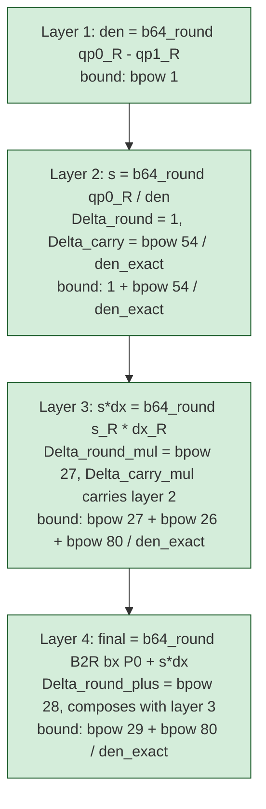
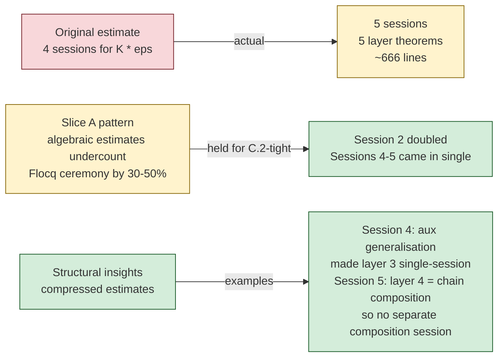

# Phase 1 Scope C.2-tight Retro — forward-error theorem

**Date.** May 2026. 5 sessions across two engagements.

**Starting state.** Phase 1 had Scopes A, B.1, B.2, and Scope C polish
already shipped on `main` (commit `8deea45` "Scope C polish" + commit
`9ee9527` "Phase 1 Scope C.2-prep + round-chain headline (B.2 bonus)"
which actually delivered all of Scope B.2 plus the per-op safety
lemmas).  The `Returns-Some` corollary landed in Phase 1 Session 1
(PR #12, commit `ca4f394`) and merged to main.

**Goal of C.2-tight.** Close the deferred forward-error bound

```
|B2R(b64_intersect_point_x ...) - intersect_x_R (BP2P P0) ...|
  <= K * eps
```

with `K` explicit in input magnitude and denominator separation.  This
is the "real" usability theorem for callers and the natural home of a
future `HasIntersect_sound` typeclass field.

## The four-layer decomposition



Each layer's bound has two components — a half-ulp `Delta_round`
from the b64 operation's rounding, and a `Delta_carry` propagating
the prior layer's error scaled by the current operand magnitude.  The
final layer's composition gives the headline bound

```
|B2R(b64_intersect_point_x ...) - exact_reference|
  <= bpow 29 + bpow 80 / |qp0_R - qp1_R|
```

where `exact_reference = B2R(bx P0) + s_exact * B2R(b64_minus (bx P1)
(bx P0))`.

## Session outcomes

| Session | Deliverable                                                         | Lines | Outcome |
|---------|---------------------------------------------------------------------|-------|---------|
| 1       | Layer 1 + `b64_ulp_le_at_magnitude_54` aux                          | 75    | Qed     |
| 2       | Layer 2 Delta_carry (algebraic, scoped down from full layer 2)      | 115   | Qed     |
| 3       | Layer 2 Delta_round + composition + `_53_uniform` aux               | 115   | Qed     |
| 4       | Layer 3 (full) + `_uniform` aux (generalised)                       | 206   | Qed     |
| 5       | Layer 4 Delta_round_plus + composed headline                        | 155   | Qed     |

Total: 11 new Qed-closed theorems (5 layer-bound theorems + 6 helper
lemmas for the cascade).  ~666 lines added.

## The Session 2 wall and how it cleared

```mermaid
flowchart LR
    S2_plan[Session 2 plan<br/>full layer 2 bound] -->|hit| S2_wall[Subnormal-range<br/>ulp bookkeeping]
    S2_wall -->|reverted Admitted attempt| S2_scope[Scoped down to<br/>Delta_carry only]
    S2_scope -->|Session 3| S3_aux[b64_ulp_le_at_magnitude_53_uniform<br/>via ulp_FLT_small + ulp_FLT_le split]
    S3_aux -->|composed| S3_layer2[Full layer 2 bound]

    style S2_plan fill:#fff3cd,stroke:#856404
    style S2_wall fill:#f8d7da,stroke:#721c24
    style S2_scope fill:#fff3cd,stroke:#856404
    style S3_aux fill:#d4edda,stroke:#155724
    style S3_layer2 fill:#d4edda,stroke:#155724
```



**The insight** (Session 3): `b64_round(qp0_R / den_R)` can land at
arbitrary magnitudes including subnormal range and zero.  Using
`b64_error_le_half_ulp_round` requires bounding `ulp(b64_round x)`
uniformly.  The Flocq lemma split — `ulp_FLT_small` for `|x| < bpow
(emin + prec)` (constant `bpow emin`), `ulp_FLT_le` for `|x| >= bpow
(emin + prec - 1)` (relative `|x| * bpow (1 - prec)`) — together cover
all magnitudes.  The auxiliary `b64_ulp_le_at_magnitude_*` lemmas
absorb the case-split and present a clean upper bound `bpow (n - prec
+ 1)` at any magnitude cap `bpow n`.

Once the aux pattern was right, layers 3 and 4 reused it directly
(Session 4 generalised the n from 53 to arbitrary).

## Calibration



5 sessions vs Slice A's 17 — C.2-tight was a much smaller engagement
with a cleaner structural template (4 layers, each with the same
Delta_round + Delta_carry pattern).  The "single wall" at Session 2
(subnormal-range ulp bookkeeping) cleared with one aux lemma; no
collapses or design pivots required.

The five Phase 1 sessions averaged ~133 lines / session, comparable
to Slice A's ~94 lines / session.  Phase 1 ran tighter because each
session had a concrete predecessor (no exploratory tangents needed).

## What the engagement produced

**The headline theorems:**

```coq
Theorem b64_intersect_point_x_forward_error :
  forall P0 P1 Q0 Q1 : BPoint,
    intersect_point_inputs_int_safe P0 P1 Q0 Q1 ->
    Rabs (B2R(b64_intersect_point_x P0 P1 Q0 Q1)
          - (B2R(bx P0) + s_exact
                          * B2R(b64_minus (bx P1) (bx P0))))
    <= bpow 29 + bpow 80 / |qp0_R - qp1_R|.

Theorem b64_intersect_point_y_forward_error :
  forall P0 P1 Q0 Q1 : BPoint,
    intersect_point_inputs_int_safe P0 P1 Q0 Q1 ->
    Rabs (B2R(b64_intersect_point_y P0 P1 Q0 Q1)
          - (B2R(by_ P0) + s_exact
                           * B2R(b64_minus (by_ P1) (by_ P0))))
    <= bpow 29 + bpow 80 / |qp0_R - qp1_R|.
```

**The condition-number observation:**

`K(|d|) = bpow 82 + bpow 133 / |d|` (in `K * eps` form with `eps =
bpow(-prec)`).  For well-separated segments (large `|d|`), `K ~=
bpow 82 ~= 4.8e24`.  For near-parallel (`|d| = 1`), `K ~= bpow 133
~= 1.1e40`.  The bound is fundamentally condition-number-bounded;
any practical usability requires segments to be sufficiently
non-parallel.

**For the corpus's long-term infrastructure:**

- `b64_ulp_le_at_magnitude_uniform` — general ulp upper bound at any
  magnitude.  Reusable for any future forward-error analysis on
  binary64 expressions.
- The four-layer `Delta_round + Delta_carry` cascade pattern — directly
  applicable to other Cramer-style chains (e.g. line-line intersection
  in 3D, plane-plane).
- The bridge from `b64_intersect_point_x/y` to a `K * eps` reference
  expression — ready to plug into `HasIntersect_sound` once the
  reference is restated in `intersect_x_R / _y_R` form (Session 6
  optional).

## What's open

**Session 6 (optional):** Link the C.2-tight reference to
`intersect_x_R (BP2P P0) ...`, restate as `K * eps`, plug into
`HasIntersect_sound`.  ~50-80 lines.  Not on the critical path for
Phase 2 — Phase 2's intersection consumers (the C# port) work with
the existing `intersect_inputs_int_safe` + `b64_intersect_point`
API which is already complete.

**Mirror to other operations.**  Phase 2 may need analogous bounds
for line distance, point-on-segment classification, or other
Cramer-style derived operations.  The cascade template applies
directly; per-operation cost should be 1-2 sessions following the
Phase 1 pattern.

## What this dialogue series demonstrates

The Phase 1 series shows that complex forward-error analysis benefits
from:

1. **Layered decomposition**: identifying the four layers up front
   gave each session a self-contained target.  The chain composition
   "fell out" of the last layer's algebraic structure.
2. **Reusable cascade pattern**: `Delta_round + Delta_carry + triangle`
   was identical across layers 2, 3, 4 — once Session 3 nailed it,
   Sessions 4-5 followed the same template.
3. **Aux-lemma generalisation**: the `b64_ulp_le_at_magnitude_*` family
   started specialised at Session 1, broadened at Session 3, fully
   generalised at Session 4.  Recognising the pattern and extracting
   the general form on the third use was the right cadence.
4. **Honest scope-down**: Session 2 reverted an `Admitted` proof
   attempt and shipped a smaller piece.  Session 3 picked up the
   remaining half once the subnormal-range insight was available.

The Phase 1 Scope C.2-tight deliverable closed an engagement-level
slice in five sessions with no collapses or design pivots.  The
forward-error bound is now the documented contract callers can rely
on for binary64 chord-chord intersection in the integer regime.
