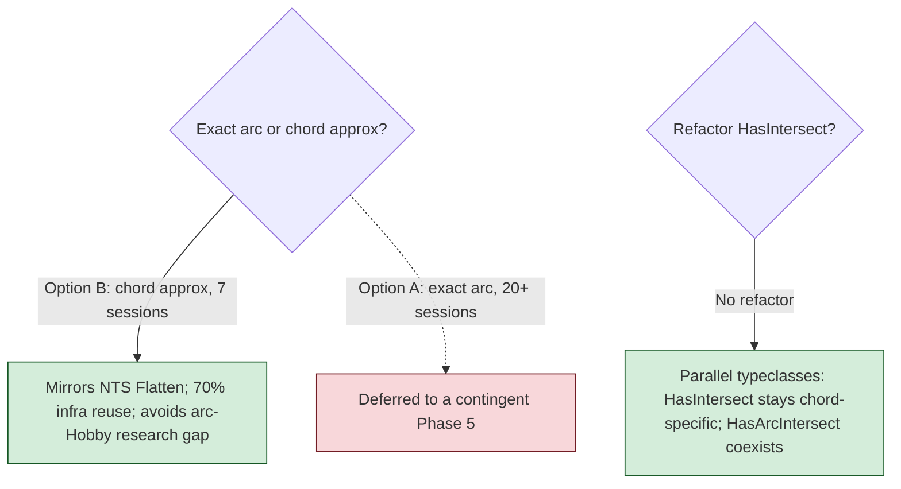
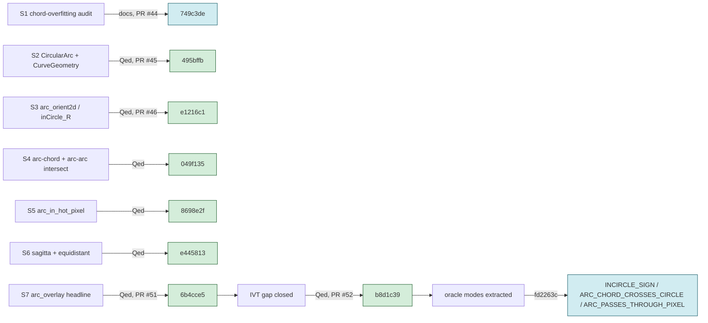
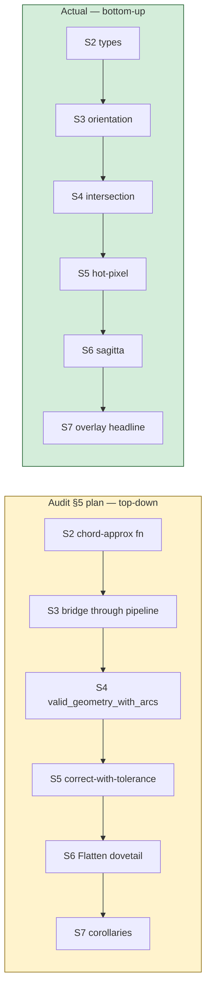
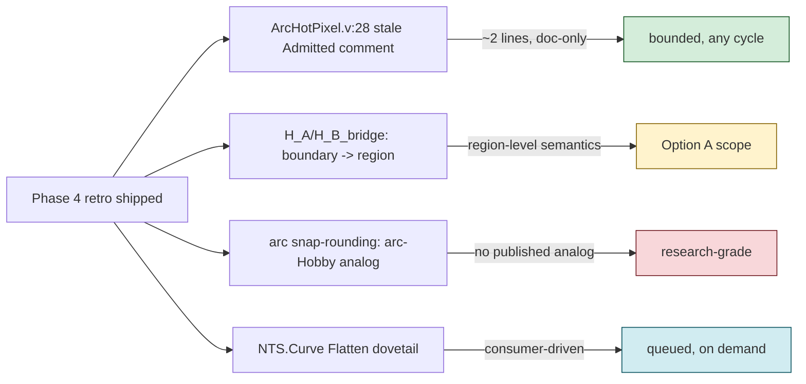

# Phase 4 Retro — Native Circular Arcs (Chord-Approximation / Option B)

**Date.** 2026-05-29 / 2026-05-30. One audit session plus seven proof
sessions, then two follow-up cycles (IVT closure, oracle extraction).

**Context.** Phase 4 is the native-curve thread: formalising the
SQL/MM `CIRCULARSTRING` / `COMPOUNDCURVE` model on top of the chord
paradigm the rest of the corpus already lives in. It opened after the
Phase 3 overlay conditional headline landed, with a strategic question
hanging over it — *exact arc geometry or chord approximation?* — and a
companion question of whether the existing `HasIntersect` machinery had
to be refactored to admit arcs. Both were resolved in the audit phase
before any `.v` file was written. This retro records how the committed
7-session Option B plan actually executed, where it diverged from the
audit's planned ordering, and the one honest caveat the headline
carries.

## The decisions that framed the phase

Two load-bearing decisions were settled in
[`docs/audit-phase4-chord-overfitting.md`](audit-phase4-chord-overfitting.md)
*before* Session 2, and neither moved afterwards:

The chord-overfitting audit's theorem-by-theorem accounting (~15
TRANSFER, ~7 GENERALIZE, ~9 NEW PROOF) is what made Option B's "70%
infrastructure reuse" a number rather than a hope. That accounting is
the reason the phase ran in sessions, not months.

## Session outcomes

| Session | Deliverable | Module | Outcome |
|---|---|---|---|
| S1 | chord-overfitting per-theorem audit + Option B decision | — | docs only |
| S2 | `CircularArc` type, `to_geometry` bridge, validity predicates | `CurveGeometry.v` (286) | Qed |
| S3 | `inCircle_R`, `arc_orient`, three-point circumcircle orientation | `ArcOrient.v` (258) | Qed |
| S4 | arc-chord + arc-arc intersection predicates | `ArcIntersect.v` (214) | Qed (soundness deferred to IVT) |
| S5 | `arc_passes_through_hot_pixel` decision procedure + structural lemmas | `ArcHotPixel.v` (258) | Qed |
| S6 | sagitta machinery, `arc_center_equidistant`, Pythagorean radius identity | `ArcChordApprox.v` (410) | Qed |
| S7 | `arc_overlay_correct_chord_approx` — Phase 4 conditional headline | `ArcOverlay.v` (288) | Qed |
| +IVT | `chord_crosses_arc_circle_implies_circle_intersection` | `ArcIntersectIVT.v` (210) | Qed — closes the S4 gap |
| +oracle | three hand-rolled differential-testing modes | extraction | extracted |

Seven proof sessions Qed-closed, the deferred soundness gap closed in a
dedicated follow-up, and the oracle layer extracted for differential
testing. **Zero `Admitted` in all seven Phase 4 theory files** at the
end of the phase.

## The plan-vs-execution divergence

The audit's §5 session plan and the executed order are *not* the same,
and the difference is the most instructive thing in this retro.

The audit planned **top-down** — start at the chord-approximation
function and the headline-shaped tolerance theorem, fill the predicates
in behind it. Execution went **bottom-up** — types, then the orient and
inCircle predicates, then intersection, then the hot-pixel and sagitta
layers, and only then the overlay headline that consumes all of them.

The bottom-up order was the right call and the plan's order would have
forced the headline to be stated against predicates that did not yet
exist. The lesson carried forward: **a strategic audit is good at
naming the deliverables and terrible at ordering them.** Ordering is a
tactical property of the dependency graph and is better decided one
session ahead, with the actual `Require` edges in view, than committed
in the scoping doc.

## The IVT gap — a clean deferral that closed

S4 stated the arc-chord intersection *predicate* but left
`arc_chord_intersect_sound` (sign-change on the chord ⇒ a real
circumcircle crossing exists) open, because the witness needs an
intermediate-value argument, not algebra. S5–S7 were built so that none
of them depended on that soundness direction — the hot-pixel decision
procedure and the overlay headline are stated over the predicate, not
its soundness. That discipline is why the gap could sit open across four
sessions without blocking the headline.

The follow-up cycle (`b8d1c39`, PR #52) closed it directly:
`inCircle_along_chord` is a polynomial in the chord parameter `t`, hence
continuous (`Ranalysis_reg`'s `reg` tactic + `derivable_continuous`);
the sign-product `< 0` at the endpoints feeds `IVT_cor`; the witness is
`chord_point P Q t`. One module, 210 lines, Qed. The take-away: **state
the predicate and the consumers against it; defer the
existence-of-witness direction to its own analytic cycle.** It kept the
geometry sessions purely algebraic and quarantined the one piece that
genuinely needed real analysis.

> **Doc-drift note.** `theories/ArcHotPixel.v:28` still describes
> `arc_chord_intersect_sound` as "(Admitted, IVT-blocked)". That
> comment predates the IVT closure and is now stale — the gap is Qed.
> Cheap cleanup for a future cycle; flagged here so it isn't mistaken
> for a live `Admitted`.

## The one honest caveat on the headline

`arc_overlay_correct_chord_approx` is Qed-closed, in the Phase 3
conditional-headline idiom: a clean case split on `BooleanOp`, each case
discharged by an `H_A_bridge` / `H_B_bridge` hypothesis. But the
hypotheses are stronger than the bare sagitta bound S6 delivers, and the
module says so out loud (`ArcOverlay.v:111-130`):

- `arc_close_to_curves` is **boundary** closeness — proximity to the 1D
  arc *curve*, not membership in the 2D arc *region*.
- The sagitta bound is a boundary-distance bound. For points deep inside
  a chord-polygon, boundary distance is large while region membership
  still matches exactly — so the bridge hypotheses ask for more than the
  sagitta lemma alone proves, except when the polygon is close in size
  to the sagitta.

This is the seam where Option B's epistemic guarantee ends and Option
A's region-level semantics would begin. The headline is structurally
correct and honestly scoped; tightening `H_*_bridge` from
boundary-closeness to region-equivalence is exactly the work a future
Option A phase would own. Recording it here keeps the conditional's
strength legible rather than buried in a source comment.

## Calibration

The audit estimated Option B at 7 sessions and Option A at 20+. Option
B landed in 7 proof sessions **plus** two follow-ups (IVT, oracle) the
plan didn't separately budget. Two observations:

- The 7-session estimate was accurate *for the headline*, but
  "complete the phase" quietly included the IVT closure and the oracle
  extraction. The honest unit is "headline + its deferred analytic gap +
  its oracle mode," not "headline."
- The ~70% infrastructure-reuse claim held up. The TRANSFER list
  (structural overlay skeleton, `BooleanOp`, `point_set`, labelling)
  carried over unchanged; the headline's case-split *is* the Phase 3
  case-split with `arc_close_to_curves` swapped for the Phase 3
  conclusion. Reuse is why each geometry session was a single sitting.

## Observations worth carrying forward

**Decide the strategic fork in the audit, the ordering in the
session.** The two genuinely strategic questions (Option A/B, typeclass
refactor) were settled once, in docs, and never relitigated. The
ordering — which the audit also tried to fix — was better left to the
dependency graph. Strategy in the scoping doc; tactics one session
ahead.

**Quarantine the analytic gap.** The phase had exactly one piece that
needed real analysis (IVT for the intersection witness). Stating every
consumer against the *predicate* let six algebraic sessions stay
algebraic and confined the analysis to one 210-line module. This is the
same shape as the Phase 3 conditional headline and the Stage D "sum
correctness now, non-overlap later" split — defer the hard half along a
clean interface, close it in its own cycle.

**Name the caveat at the project level, not just in a comment.** The
boundary-vs-region gap in the headline's hypotheses is the most
important thing a downstream consumer needs to know about Phase 4, and
it currently lives only in a source comment. Surfacing it in this retro
(and ideally a README footnote) is what keeps the conditional's strength
from being overread.

**Parallel typeclasses beat refactoring.** Resolving "don't refactor
`HasIntersect`; add a parallel `HasArcIntersect`" before Session 2 meant
zero existing proofs were touched by the arc work. The chord corpus and
the arc corpus coexist; bridges compose refinement bounds. This is the
architecture that lets a future clothoid or exact-arc family attach the
same way.

## Open items as inputs to future sessions

- **Stale comment cleanup** (`ArcHotPixel.v:28`) — the only bounded
  item; the referenced `Admitted` is closed.
- **Boundary → region** — tightening the headline's bridge hypotheses;
  this is Option A's region-level semantics, not a Phase 4 patch.
- **Arc snap-rounding** — the research-grade gap the audit flagged: no
  published Hobby-theorem analog for arcs. Comparable in shape to the
  `hobby_lemma_4_3_no_proper` deferred entry.
- **`Flatten()` dovetail** — proving the corpus's chord approximation
  matches `NetTopologySuite.Curve`'s actual implementation; consumer-
  driven, queued for when someone asks.

## Axiom footprint

All seven Phase 4 theory files live in the clean Stdlib lane: they pull
only the README-allowlisted classical-reals axioms (no
`Classical_Prop.classic`, because none of them touch the snap layer).
`ArcIntersectIVT.v` adds the Stdlib `IVT_cor` / `Ranalysis_reg`
dependency, which stays within the same three-axiom allowlist. None of
the Phase 4 files appear in `docs/audit-exceptions.txt`. No `Admitted`,
no `Axiom`, no `Parameter` across the phase.

---

The native-curve thread reached its committed endpoint: a Qed-closed
conditional overlay headline for chord-approximated arcs, the analytic
gap that fed it closed in its own cycle, and three differential-testing
oracle modes extracted. The conditional's hypotheses are honestly
stronger than the bare sagitta bound — that boundary-vs-region seam is
where a future Option A phase would pick up if a downstream consumer
ever asks for exact arc geometry. Until then, Phase 4 delivers exactly
the guarantee NTS users get today: arc operations correct up to chord-
approximation tolerance, now machine-checked.
