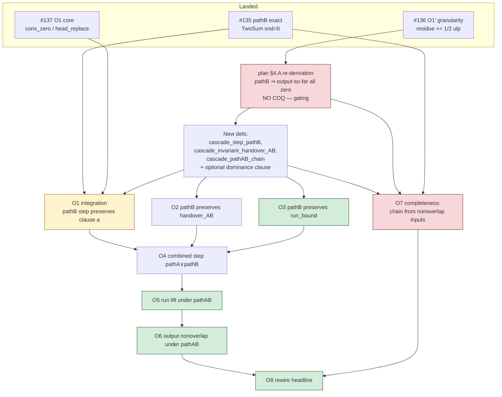

# Shewchuk Theorem 13 — obligations O2–O7: prompts, dependency graph, risk/cost

**Purpose.** Ready-to-use task prompts for the remaining cascade-side obligations
toward the deferred headline `fast_expansion_sum_nonoverlap_shewchuk`
(`theories-flocq/B64_FastExpansionSum_Shewchuk.v:483`, Admitted), plus a
dependency graph and a per-obligation risk/cost table. Design only — no Coq here.

Companion: `docs/shewchuk-thm13-pathb-plan.md` (the overall pathA ∨ pathB plan
and obligation list O1–O8) and `docs/shewchuk-theorem-13-proof-structure.md`.

## What is already on `main` (the bricks)

| Landed | Lemma(s) | File | PR |
|---|---|---|---|
| pathB arithmetic | `b64_TwoSum_exact_of_format_sum`, `b64_TwoSum_sterbenz_exact` | `B64_TwoSum_sterbenz.v` | #135 |
| O1′ granularity | `residue_ge_half_ulp` | `B64_residue_granularity.v` | #136 |
| O1 core (lists) | `nonoverlap_shewchuk_cons_zero`, `nonoverlap_shewchuk_head_replace`, `compress_cons_zero` | `B64_nonoverlap_head.v` | #137 |

Route-2 framework already Qed (pre-existing): `cascade_step_state`,
`cascade_invariant{,_output,_handover,_run_bound}`, `cascade_pathA_chain`,
`cascade_step_preserves_invariant_pathA`,
`cascade_run_preserves_invariant_under_pathA`, `cascade_run_output_nonoverlap`,
`fast_expansion_sum_nonoverlap_shewchuk_general_conditional`.

---

## ⚠ Correction to plan §4.A — read before O1-integration / O2

The plan's §4.A claimed clause (a) survives pathB "resolution 1, low risk". That
was **too optimistic**, for two reasons discovered during O1:

1. **`strict_succ_b64 a b := |B2R b| ≤ ulp(B2R a)/2` is far stronger than
   "non-overlapping".** It forces `b` into the half-ulp (rounding-error) band of
   `a`. Example: `256` and `1` are bit-disjoint integers, yet
   `strict_succ_b64 256 1` is **false** (`1 > ulp(256)/2 = 2⁻⁴⁵`).
2. **The cascade processes magnitude-*ascending*; `nonoverlap_shewchuk` orders
   *descending*.** So the §4.A example lists (`[1, 2^60]`) are not even
   `nonoverlap_shewchuk` inputs; valid inputs are `[2^60, 1]`-style, widely
   separated (consecutive components differ by ≥ ~2⁵³).

**Consequence for the dominance precondition of `head_replace`.** After a pathB
cancellation `carry' = x + C` (small), the chain `carry' :: h_k :: …` needs
`strict_succ_b64 carry' h_k`, i.e. `|h_k| ≤ ulp(carry')/2`. The O1′ granularity
bound gives `|carry'| ≥ ½ulp(C)` and `|h_k| ≤ ½ulp(C)` — but `carry'` is *smaller*
than `C`, so `ulp(carry') ≤ ulp(C)` and `½ulp(C)` is **not** `≤ ulp(carry')/2`.
The bound as stated does **not** close the dominance. The real reason the
algorithm is correct is structural: in a `nonoverlap_shewchuk` input no two
*same-source* components are within Sterbenz range, so pathB only fires
cross-source, and the residue is then absorbed by strictly larger later inputs
(ascending order) while the output emitted *during* a cancellation run is zero
(`snd = 0`). I.e. **resolution 1 is probably right, but the precise statement is
"pathB fires only when `compress (rev cs_output) = nil`" (output-so-far all
zero), not "the residue dominates a nonzero output".**

**Mandatory pre-work (no Coq), gating O1-integration and O2:** re-derive §4.A
rigorously — prove on paper that, for `nonoverlap_shewchuk e/f` and ascending
processing, *whenever the pathB trigger holds the current `compress (rev
cs_output)` is `nil`*. If true, `head_replace`'s dominance precondition is
discharged by its first disjunct (`B2R carry' = 0`) or vacuously (empty output),
and the cascade integration is tractable. If false, a strengthened "carry
dominates all output" invariant clause is required and the cost rises sharply.

---

## Dependency graph



Critical path: **§4.A → DEFS → O1 → O4 → O5 → O6 → O8**, with **O7** a parallel
hard track feeding O8. O2/O3 join at O4.

## Priority tiers — cost, risk, and concrete session-output goal

Tiers are priority/sequencing bands (P1 gates everything; P4 closes). The
**session-output goal** is the concrete artifact a single session should land —
the exact `Definition`/`Lemma` name, the tactic shape, and the beachhead lemma
or counterexample that decides success.

### P1 — gating (do first, no Coq)

| Item | Cost | Risk | Concrete session-output goal |
|---|---|---|---|
| §4.A re-derivation | 0.5–1 d | **High** | A written proof-sketch settling **one decision**: does the pathB trigger fire only when `compress (rev cs_output) = nil`? **Beachhead lemma to state (target, prove later):** `pathB_fires_only_when_output_compressed_empty`. **Evidence:** 2–3 `vm_compute` cascade traces on concrete cross-sign `nonoverlap` inputs (e.g. `e=[2^60;1]`, `f=[-2^60]`) recording `(cs_carry, compress (rev cs_output))` per step. **Output = a decision:** resolution-1 (empty-output ⇒ `head_replace` discharged by its `B2R a'=0`/empty disjunct) **or** resolution-2 (need a new `cs_carry`-dominates-output invariant clause). Everything below assumes the answer. |

### P2 — scaffolding (low-risk, mechanical)

| Item | Cost | Risk | Concrete session-output goal |
|---|---|---|---|
| DEFS | ~0.5 d | Low | **Definitions only, compile-clean (no proofs):** `cascade_step_pathB`, `cascade_invariant_handover_AB`, `cascade_pathAB_chain` (plus the dominance clause iff §4.A → resolution-2). Tactic: mirror `cascade_pathA_chain` (Route2 L1514); watch `let`-shape ergonomics. |
| O3 | 0.5 d | Low | **Lemma `cascade_step_pathB_preserves_run_bound` (Qed).** Tactics: `b64_TwoSum_exact_of_format_sum` ⇒ `carry' = x+C`, then `|x+C| ≤ \|x\|+\|C\|` + `lra`; case-split `prov`. Mirror Route2 L791. |
| O4 | 0.5 d | Low | **Lemma `cascade_step_preserves_invariant_AB` (Qed).** Tactic: `destruct` the pathA∨pathB disjunction; pathA branch `apply cascade_step_preserves_invariant_pathA` (L1332); pathB branch `split` → O1 ∧ O2 ∧ O3. |
| O5 | 0.25 d | Low | **Lemma `cascade_run_preserves_invariant_under_pathAB` (Qed).** Tactic: copy L1552 verbatim, call O4, `induction xs`. |
| O6 | 0.25 d | Low | **Lemma `cascade_run_output_nonoverlap_AB` (Qed).** Tactic: copy L1584, `apply` O5, read off clause (a). |

### P3 — cascade surgery (high-risk)

| Item | Cost | Risk | Concrete session-output goal |
|---|---|---|---|
| **O1** integration | 1–2 d | **High** | **Lemma `cascade_step_pathB_preserves_output` (Qed).** Lemmas to wire: `b64_TwoSum_exact_of_format_sum` (#135, gives `snd=0`, `carry'=x+C`), `nonoverlap_shewchuk_cons_zero` (#137, drop the appended `0`), `nonoverlap_shewchuk_head_replace` (#137), `residue_ge_half_ulp` (#136, the dominance witness). Tactic: rewrite output via `cons_zero`, `apply head_replace`, discharge its disjunct per §4.A (empty-output ⇒ left disjunct `B2R carry'=0` or trivial). |
| **O2** handover_AB | 1–2 d | **High** | **Lemma `cascade_step_pathB_preserves_handover` (Qed).** Beachhead: show the post-cancellation `(carry', x')` pair (next ascending input `\|x'\| ≥ \|x\|`) lands in a pathA half-ulp **absorption** disjunct (small `carry'` dominated by larger `x'`). Lemmas: `b64_plus_abs_bound` (L539), the sorted-order hyp in the chain, run-bound. Re-establish `b64_TwoSum_safe (x',carry')`. |

### P4 — completeness + close (very high, then trivial)

| Item | Cost | Risk | Concrete session-output goal |
|---|---|---|---|
| **O7** completeness | 2–4 d | **Very high** | **Lemma `cascade_pathAB_chain_from_nonoverlap` (Qed)** — discharges the chain from `fast_expansion_sum_safe ∧ nonoverlap e ∧ nonoverlap f`. **Beachhead to prove FIRST:** `not_half_ulp_separated_implies_sterbenz` (opposite sign + neither half-ulp-dominates ⇒ `\|q\|/2 ≤ \|x\| ≤ 2\|q\|`). **Counterexample to rule out:** exhibit (or prove impossible) an opposite-sign pair in *neither* the pathA half-ulp band *nor* Sterbenz range — if one exists, a pathC is needed. Tactic: sign case-split + per-source nonoverlap (same-source ≥ ~2⁵³ apart ⇒ never Sterbenz, so pathB is cross-source only). |
| O8 | 0.25 d | Low | **Close the headline: `fast_expansion_sum_nonoverlap_shewchuk` (Qed), removing the Admitted at `B64_FastExpansionSum_Shewchuk.v:483`.** Tactic: in `..._general_conditional` (L2196) swap `cascade_pathA_chain`→`cascade_pathAB_chain` and `cascade_run_output_nonoverlap`→O6; discharge the chain with O7. |

Trivially-missing brick (any time): `b64_TwoSum_sterbenz_exact_neg` (mirror of
#135 for `x<0<q`, ~10 lines).

---

## Prompts

Each prompt is self-contained for a fresh session. All share these **standing
instructions**: develop on a feature branch off `main`; build with the Flocq
host-install fallback (`docs/development-environment.md`); register new files in
`_CoqProject.full`; if the file pulls `Classical_Prop.classic` add a documented
entry to `docs/audit-exceptions.txt`; verify with the full gauntlet
(`check_admitted.sh`, sequential build + `audit_axioms.sh`,
`check_readme_axioms.sh`) and confirm via `Print Assumptions` that the deferred
`fast_expansion_sum_nonoverlap_shewchuk` is **not** a dependency; everything
ends in `Qed` (no new `Admitted`/`Axiom`/`Parameter`); open a PR.

> **Prereq for O2:** the DEFS file must exist (define `cascade_step_pathB`,
> `cascade_invariant_handover_AB`, `cascade_pathAB_chain` per plan §2, plus any
> dominance clause §4.A dictates) and O1 integration should be landed or in the
> same branch. O3 only needs DEFS.

### Prompt — O2 (pathB preserves the AB-handover)

```
Goal: prove that a pathB cascade step preserves the widened handover invariant.

Statement (adjust names to the DEFS file):
  Lemma cascade_step_pathB_preserves_handover :
    forall state x prov rest,
      cascade_invariant_handover_AB state ((x, prov) :: rest) ->
      cascade_step_pathB state x ->
      cascade_invariant_handover_AB (cascade_step_state state x prov) rest.

Context: cascade_step_state sets carry' = fst (b64_TwoSum x (cs_carry state)),
which under cascade_step_pathB equals B2R x + B2R (cs_carry state) exactly
(b64_TwoSum_exact_of_format_sum, B64_TwoSum_sterbenz.v).  handover_AB on `rest`
asks the NEXT input x' to be pathA-or-(exact-sum) against carry'.

Strategy:
  - rest = nil: trivial.
  - rest = (x',_)::_ : carry' is the small cancellation residue; x' is the next
    magnitude-ascending input so |x'| >= |x| >= |C|/2.  Show (carry', x') lands
    in a pathA half-ulp absorption disjunct (carry' is dominated by the larger
    x'), OR exact-sum.  Use the sorted-order hypothesis carried in the chain and
    the run-bound; reuse b64_plus_abs_bound (Route2 L539) for the safety side.

Gotchas: requires the §4.A re-derivation outcome (whether carry' is 0 / output
empty).  The b64_TwoSum_safe side-condition of handover_AB must be re-established
for (x', carry'); thread it from the chain.
Risk: HIGH.  Acceptance: Qed; gauntlet; no deferred-headline dep.
```

### Prompt — O3 (pathB preserves the run-bound)

```
Goal: prove the run-bound clause survives a pathB step.

Statement:
  Lemma cascade_step_pathB_preserves_run_bound :
    forall state x prov,
      cascade_invariant_run_bound state ->
      cascade_step_pathB state x ->
      cascade_invariant_run_bound (cascade_step_state state x prov).

Where cascade_invariant_run_bound state :=
  |B2R (cs_carry state)| <= 2|B2R (cs_e_max state)| + 2|B2R (cs_f_max state)|.

Strategy: carry' = B2R x + B2R (cs_carry state) (exact, via
b64_TwoSum_exact_of_format_sum), so |carry'| <= |x| + |cs_carry|.  The step sets
the matching source max to x, so the RHS gains 2|x|, which dominates.  Mirror
the existing pathA run-bound lemma (Route2 ~L791); mostly lra + the triangle
inequality.  Case-split on prov (from_e / from_f).
Risk: LOW.  Acceptance: Qed; gauntlet.
```

### Prompt — O4 (combined single-step preservation)

```
Goal: one cascade step preserves the full invariant under pathA OR pathB.

Statement:
  Lemma cascade_step_preserves_invariant_AB :
    forall state processed x prov rest,
      cascade_invariant state processed ((x,prov)::rest) ->
      ( cascade_step_pathA_conditions state x prov
        \/ cascade_step_pathB state x ) ->
      cascade_invariant (cascade_step_state state x prov) (processed++[x]) rest.

Strategy: destruct the disjunction.
  - pathA branch: apply the existing Qed cascade_step_preserves_invariant_pathA
    (Route2 L1332) — its hypotheses are exactly cascade_step_pathA_conditions.
  - pathB branch: split cascade_invariant into its three clauses and apply
    O1 (clause a), O2 (handover), O3 (run-bound).
Note: if cascade_invariant gained a dominance clause in DEFS, add its
preservation here for both branches.
Risk: LOW (assuming O1–O3).  Acceptance: Qed; gauntlet.
```

### Prompt — O5 (run lift under the AB chain)

```
Goal: lift single-step preservation over a whole run.

Statement:
  Lemma cascade_run_preserves_invariant_under_pathAB :
    forall xs state processed,
      cascade_invariant state processed xs ->
      cascade_pathAB_chain state xs ->
      cascade_invariant (cascade_run state xs) (processed ++ untag xs) nil.

Strategy: COPY cascade_run_preserves_invariant_under_pathA (Route2 L1552)
verbatim, replacing the per-step call with O4 and cascade_pathA_chain with
cascade_pathAB_chain.  Same list induction (untag_cons_pair, app_assoc).
Risk: LOW.  Acceptance: Qed; gauntlet.
```

### Prompt — O6 (output nonoverlap under the AB chain)

```
Goal: the cascade output is nonoverlap_shewchuk under the AB chain.

Statement:
  Lemma cascade_run_output_nonoverlap_AB :
    forall init_state tagged_rest,
      cascade_invariant init_state nil tagged_rest ->
      cascade_pathAB_chain init_state tagged_rest ->
      nonoverlap_shewchuk
        (cs_carry (cascade_run init_state tagged_rest)
         :: rev (cs_output (cascade_run init_state tagged_rest))).

Strategy: COPY cascade_run_output_nonoverlap (Route2 L1584): apply O5, then read
off clause (a) (cascade_invariant_output) of the final state.
Risk: LOW.  Acceptance: Qed; gauntlet.
```

### Prompt — O7 (completeness: discharge the chain from real preconditions)

```
Goal: the AB chain holds for the actual fast_expansion_sum input.  THIS is what
pathA alone provably could not satisfy (B64_Shewchuk_Thm13_pathA_defect.v).

Statement:
  Lemma cascade_pathAB_chain_from_nonoverlap :
    forall e f x prov rest,
      fast_expansion_sum_safe e f ->
      nonoverlap_shewchuk e -> nonoverlap_shewchuk f ->
      tagged_input e f = (x,prov)::rest ->
      cascade_pathAB_chain (initial_cascade_state x prov) rest.

Strategy (the hard case analysis, per plan §4.B):
  At each step the (x_i, carry) pair is:
   - same sign  -> a pathA same-sign disjunct;
   - opposite sign, one half-ulp-dominates the other -> a pathA half-ulp
     disjunct;
   - opposite sign, similar magnitude -> show Sterbenz range (|q|/2 <= |x_i| <=
     2|q|) holds (key sub-lemma: "not half-ulp-separated => within factor 2"),
     hence b64_format (B2R x_i + B2R carry) -> pathB.
  Must also re-establish the handover_AB and the (induction) chain tail at each
  step.  Lean on: the sorted-ascending order of tagged_input, per-source
  nonoverlap (same-source pairs are >= ~2^53 apart, so never Sterbenz),
  b64_TwoSum_sterbenz_exact(+_neg), residue_ge_half_ulp.

Gotchas: ensure pathA-half-ulp and Sterbenz-range COVER all opposite-sign cases
with no gap (else a pathC is needed).  Depends on the §4.A re-derivation.
Risk: VERY HIGH (multi-day, the core of Theorem 13).  Acceptance: Qed; gauntlet;
no deferred-headline dep.
```

> **O8** (out of the requested O2–O7 range, included for closure): in
> `..._general_conditional` (Route2 L2196) replace `cascade_pathA_chain` with
> `cascade_pathAB_chain` and `cascade_run_output_nonoverlap` with O6, then prove
> the unconditional `fast_expansion_sum_nonoverlap_shewchuk` by discharging the
> chain hypothesis with O7. Replaces the Admitted at
> `B64_FastExpansionSum_Shewchuk.v:483`. Risk LOW once O6+O7 land.

---

## Recommended order (by tier)

1. **P1** — §4.A re-derivation (gating; no Coq).
2. **P2** — DEFS, then O3 → O4 → O5 → O6 (the low-risk scaffolding chain).
3. **P3** — O1 integration, then O2 (resolve dominance per §4.A).
4. **P4** — O7 (the long pole; parallelisable with P2/P3), then O8 to close.

Stop-and-document discipline: if §4.A re-derivation shows the strengthened
dominance invariant is required (not resolution 1), re-scope O1/O2/O4 upward and
record it before writing proofs — that is the branch that turns this from
"~1 week" into "thesis-scale".
